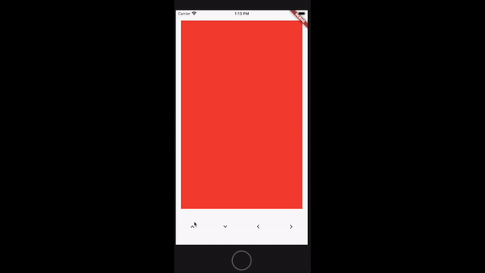

# Flutter Swipe Card

The easiest way to implement a tinder-like swipe card mechanism in Flutter.

The package contains a **SwipeCard** widget allowing to make content swipable.

## Getting Started

To import the widget:

```dart
import 'package:swipe_card/swipe_card.dart'
```

Make a widget *swipable*:

```dart
Swipable(
    child: Container(
        height: double.infinity,
        width: double.infinity,
        color: Colors.red
    )
)
```

## Configuration

### Trigger an automatic swipe

You can trigger a swipe programatically by passing a `Stream<double>` to the widget using this parameter:

```dart
/// @param swipe [Stream<double>]
/// Triggers an automatic swipe.
/// Cancels automatically after first emission.R
/// The double value sent corresponds to the direction the card should follow (clockwise radian angle).
final Stream<double> swipe;
```

#### Example

```dart

/// Create the stream
StreamController<double> _controller = StreamController<double>();


/// Pass the stream to the widget
Swipable(
    swipe: _controller.stream
    child: Container(
        height: double.infinity,
        width: double.infinity,
        color: Colors.red
    )
)

/// Trigger programmatically
double swipeAngle = math.pi / 4;
_controller.add(swipeAngle);
```

⚠️ !!! The widget will automatically unsubscribe after the first emission.

Now we're able to swipe content programmatically:



### Hooks

You can register a set of callbacks to react to the following hooks:

```dart
/// Callback
/// Hook triggered when the card starts being dragged.
/// @param details [DragStartDetails]
final void Function(DragStartDetails details) onSwipeStart;

/// Callback
/// Hook triggered when the card position changes.
/// @param details [DragUpdateDetails]
final void Function(DragUpdateDetails details) onPositionChanged;

/// Callback
/// Hook triggered when the card stopped being dragged and doesn't meet the requirement to be swiped.
/// @param details [DragEndDetails]
final void Function(Offset position, DragEndDetails details) onSwipeCancel;

/// Callback
/// Hook triggered when the card stopped being dragged and meets the requirement to be swiped.
/// @param details [DragEndDetails]
final void Function(Offset position, DragEndDetails details) onSwipeEnd;

/// Callback
/// Hook triggered when the card finished swiping right.
/// @param finalPosition [Offset]
final void Function(Offset finalPosition) onSwipeRight;

/// Callback
/// Hook triggered when the card finished swiping left.
/// @param finalPosition [Offset]
final void Function(Offset finalPosition) onSwipeLeft;

/// Callback
/// Hook triggered when the card finished swiping up.
/// @param finalPosition [Offset]
final void Function(Offset finalPosition) onSwipeUp;

/// Callback
/// Hook triggered when the card finished swiping down.
/// @param finalPosition [Offset]
final void Function(Offset finalPosition) onSwipeDown;
```

### Additional parameters

You can pass additional parameters to the **Swipable** widget:

```dart
/// @param animationDuration [int]
/// Animation duration (in milliseconds) for the card to swipe atuomatically or get back to its original position on swipe cancel.
final int animationDuration;

/// @param animationCurve [Curve]
/// Animation timing function.
final Curve animationCurve;

/// @param threshold [double]
/// Defines the strength needed for a card to be swiped.
/// The bigger, the easier it is to swipe.
final double threshold;
```

## Author

Loïc Combis (combis.loic@gmail.com)
